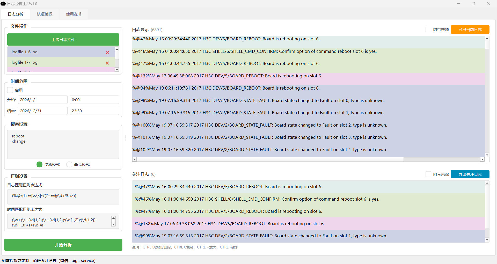
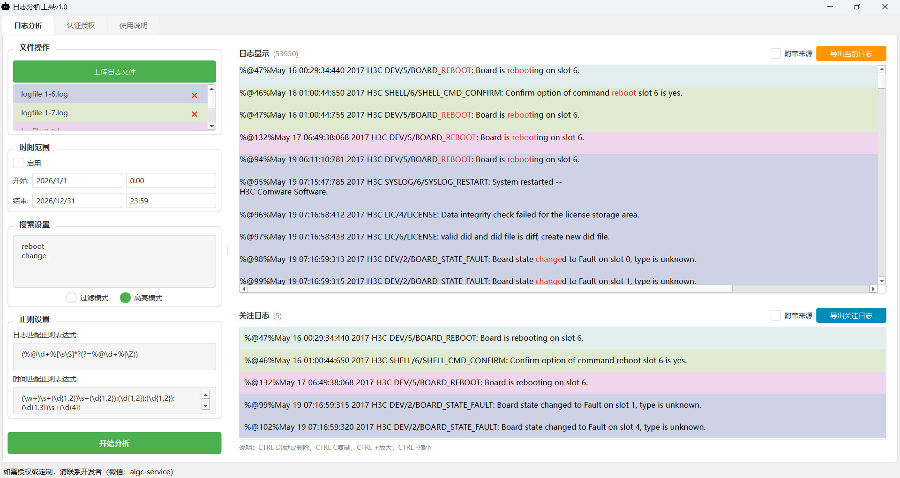

---

[English](./readme_en.md) | [中文](./README.md)

# 日志分析工具 | 网络工程师运维故障排查提效神器 (2025)

> 一款专为运维工程师设计的开源日志分析工具，支持多文件统一管理、智能时间线解析、多维度筛选，助力网络故障排查效率提升10-15倍。

---

## 📋 内容目录

- [工具概述](#工具概述)
- [运维工程师核心痛点](#运维工程师核心痛点)
- [解决方案详解](#解决方案详解)
- [效率提升量化分析](#效率提升量化分析)
- [为什么选择本工具](#为什么选择本工具)
- [适用场景清单](#适用场景清单)
- [常见问题FAQ](#常见问题faq)
- [获取与使用](#获取与使用)

---

## 工具概述

### 什么是日志分析工具？

日志分析工具是一款专为IT运维工程师设计的桌面应用程序，核心功能是帮助网络工程师快速分析多源日志、定位网络故障、根除问题根因。该工具采用先进的分页虚拟滚动技术，支持GB级日志文件流畅处理，同时提供智能时间线解析、多维度筛选、关注日志一键导出等实用功能。


### 核心功能一览

| 功能模块 | 功能描述 | 适用场景 |
|---------|---------|---------|
| 多文件统一管理 | 批量拖拽上传，自动识别格式，颜色区分来源 | 多设备日志同时分析 |
| 智能时间解析 | 自定义正则配置，自动提取时间戳，毫秒级精度 | 故障时间线还原 |
| 多维度筛选 | 关键词高亮、正则匹配、时间范围过滤 | 快速定位问题日志 |
| 关注日志导出 | 勾选关键日志，一键导出带来源标记 | 故障报告编写 |
| 大文件处理 | 分页虚拟滚动，GB级文件流畅运行 | 核心设备历史日志分析 |

### 目标用户群体

- **网络运维工程师**：负责企业网络设备运维与故障排查
- **系统管理员**：管理服务器、网络设备日志分析
- **安全分析师**：分析安全设备日志，追踪攻击路径
- **IT技术支持**：为业务部门提供网络故障支持

---

## 运维工程师核心痛点

### 痛点一：多源日志的「信息爆炸」困境

运维工程师的日常工作涉及大量网络设备：路由器、交换机、防火墙、负载均衡器、服务器等。每台设备都在持续输出日志，一次故障排查往往需要同时查看5-10个设备的日志文件。

**现实数据**：
- 中等规模数据中心：50+台网络设备
- 单次故障排查：需分析5-10个设备日志
- 单个日志文件大小：几百MB至数GB
- 日志格式差异：Cisco syslog、华为设备日志、Linux系统日志、Windows事件日志

**传统解决方案的局限**：
工程师需要在多个终端窗口之间来回切换，使用`tail -f`命令分别查看不同文件。这种方式极易造成大脑疲劳，关键信息容易被遗漏。

### 痛点二：时间线混乱的「时空错乱」

故障排查中最令人困扰的问题是确定故障发生的先后顺序：

```
设备A日志：Jan 15 14:23:45 链路断开
设备B日志：Jan 15 14:23:47 邻居关系Down
设备C日志：Jan 15 14:23:50 路由收敛完成
```

**实际困难**：
- 各设备时钟存在毫秒级偏差
- 日志格式不统一（有的带毫秒，有的不带）
- 时区设置不一致
- 手动对齐时间线耗时且容易出错

### 痛点三：日志筛选的「大海捞针」

面对百万行日志时，传统grep命令显得力不从心：

```bash
# 运维工程师常用命令组合
cat *.log | grep "ERROR" | grep -v "DEBUG" | awk '{print $1,$2,$3}' | sort | uniq -c
```

**核心问题**：
- 正则表达式编写调试费时费力
- 无法直观查看上下文
- 多条件组合筛选时命令难以维护
- 筛选结果无法保存和复用

### 痛点四：故障现场的「证据保全」难题

找到关键日志后，工程师需要：
- 截图保存（无法搜索）
- 复制粘贴到记事本（格式丢失）
- 手动标注来源设备（容易出错）
- 整理成故障报告（耗时耗力）

### 痛点五：大文件处理的「内存焦虑」

处理大型日志文件时，传统工具表现不佳：
- Notepad++：超过100MB文件卡死
- VS Code：提示"文件过大"
- 命令行工具：交互体验差

---

## 解决方案详解

### 方案一：多文件统一管理

**功能特性**：
- **批量上传**：一次性拖拽多个日志文件，系统自动识别格式
- **颜色编码**：不同来源日志用不同背景色区分（路由器浅蓝、交换机浅绿、防火墙浅黄）
- **统一视图**：所有日志按时间戳自动排序，形成完整时间线

**典型应用场景**：
> 某次网络抖动故障，需要同时分析核心交换机、汇聚交换机和两台防火墙的日志。传统方式需要开4个SSH窗口用tail命令分别查看。使用本工具，直接拖拽4个日志文件，系统自动用不同颜色标记来源，一眼就能看出哪个设备最先出现异常。

### 方案二：智能时间解析

**功能特性**：
- **灵活正则配置**：支持自定义时间匹配正则，适配各种设备日志格式
- **自动时间提取**：从日志中自动提取时间戳，精确到毫秒
- **全局排序**：所有日志按时间戳统一排序，形成完整事件链

**典型应用场景**：
> 某次BGP路由震荡，需要确定是上游ISP先断还是本地配置先出问题。传统方式需要手动对比时间戳，还要考虑设备时钟偏差。使用本工具，设置好时间正则后，所有日志自动按时间排序，配合颜色区分来源，故障传播路径一目了然。

### 方案三：多维度筛选

**功能特性**：
- **关键词高亮**：支持多关键词同时高亮，不同颜色区分
- **过滤模式**：只显示匹配的日志，快速缩小范围
- **正则支持**：高级用户可用正则表达式进行复杂匹配
- **时间范围筛选**：精确到毫秒的时间窗口过滤

**典型应用场景**：
> 排查一次间歇性丢包问题，怀疑是特定时间段内的STP拓扑变化导致。传统方式需要写复杂的grep和awk命令。使用本工具，设置时间范围为故障发生前后5分钟，关键词输入"STP"和"topology"，瞬间定位到关键日志，还能保留上下文查看。

### 方案四：关注日志与导出

**功能特性**：
- **关注列表**：勾选关键日志，形成独立的关注列表
- **保持时序**：关注列表中的日志保持原始时间顺序
- **一键导出**：支持导出当前显示或关注日志，可选附带来源信息

**典型应用场景**：
> 完成故障排查后，需要写故障报告。传统方式需要手动复制粘贴关键日志，还要标注来源和时间。使用本工具，在分析过程中勾选关键日志，最后一键导出，自动生成带时间戳和来源标记的文本文件，直接粘贴到报告即可。

### 方案五：高性能处理

**技术特性**：
- **分页虚拟滚动**：只渲染当前可见区域，百万级日志不卡顿
- **多进程并行**：利用多核CPU加速文件处理
- **智能内存管理**：根据系统可用内存动态调整策略
- **编码自动检测**：支持UTF-8、GBK、GB2312等多种编码

**典型应用场景**：
> 分析一台运行了半年的核心路由器日志，文件大小2GB。传统文本编辑器直接卡死。使用本工具，系统自动分页加载，滚动流畅，还能同时进行关键词搜索和时间过滤，完全感受不到大文件的负担。

---

## 效率提升量化分析

### 典型场景耗时对比

| 操作环节 | 传统方式耗时 | 使用本工具耗时 | 效率提升 |
|---------|-------------|---------------|---------|
| 多文件加载与格式统一 | 10-15分钟 | 1分钟 | **10-15倍** |
| 时间线对齐与排序 | 20-30分钟 | 即时完成 | **∞** |
| 关键词筛选与定位 | 15-20分钟 | 2-3分钟 | **5-10倍** |
| 关键日志整理与导出 | 10-15分钟 | 1分钟 | **10-15倍** |
| **单次故障排查总计** | **55-80分钟** | **5-8分钟** | **10-15倍** |

### 年度效益测算（中型企业运维团队）

**假设条件**：
- 运维工程师：5人
- 月均故障排查次数：20次
- 平均每次排查时间：60分钟（传统）→ 6分钟（使用工具）
- 工程师时薪：100元/小时

**年度成本节省计算**：

```
每月节省时间 = 20次 × (60-6)分钟 = 1080分钟 = 18小时
每年节省时间 = 18小时 × 12月 = 216小时/人
团队年节省时间 = 216小时 × 5人 = 1080小时
年度成本节省 = 1080小时 × 100元/小时 = 108,000元
```

### 隐性收益分析

- **MTTR（平均修复时间）降低**：从小时级降至分钟级，减少业务中断损失
- **知识沉淀**：标准化日志导出格式，便于团队知识共享
- **新人培训成本降低**：图形化界面降低日志分析学习曲线
- **人为错误减少**：自动化处理避免手动操作失误

### 性能指标对比

| 指标 | 传统文本编辑器 | 命令行工具 | 本工具 |
|-----|---------------|-----------|--------|
| 支持文件大小 | <100MB | 无限制 | **无限制** |
| 多文件同时查看 | ❌ 不支持 | ⚠️ 需手动合并 | ✅ **原生支持** |
| 时间自动排序 | ❌ 不支持 | ⚠️ 需复杂脚本 | ✅ **自动完成** |
| 交互式筛选 | ❌ 不支持 | ⚠️ 命令行交互差 | ✅ **GUI友好** |
| 结果导出 | ⚠️ 手动复制 | ⚠️ 需重定向 | ✅ **一键导出** |
| 内存占用 | 高 | 低 | **低** |

---

## 为什么选择本工具

### 核心价值主张

本工具将运维工程师从繁琐的数据处理中解放出来，让工程师专注于分析问题本身而非处理数据。

**与传统工具的对比**：

| 维度 | Splunk/ELK | 本工具 |
|-----|-----------|--------|
| 部署成本 | 需要服务器资源，配置复杂 | **开箱即用，零部署** |
| 适用场景 | 长期日志存储与监控 | **临时故障排查** |
| 学习曲线 | 陡峭（需学习查询语言） | **平缓（GUI操作）** |
| 成本 | 高昂（按GB收费） | **开源免费** |
| 灵活性 | 需预先配置解析规则 | **即时配置正则** |

### 与竞品的差异化定位

- **Splunk/ELK**：战略级工具，用于长期日志管理和监控
- **本工具**：战术级工具，用于快速、临时故障排查
- **两者关系**：不是替代关系，而是互补关系

---

## 适用场景清单

### ✅ 强烈推荐使用场景

1. **紧急故障排查**：快速分析多个设备日志，确定故障根因
2. **变更影响分析**：查看配置变更前后的日志变化
3. **安全事件调查**：分析安全设备日志，追踪攻击路径
4. **性能问题定位**：通过时间线分析，定位性能瓶颈
5. **供应商协调**：导出带时间戳证据，证明问题责任方

### ❌ 不太适合的场景

1. 长期日志存储（日志管理系统功能）
2. 实时监控（不支持实时日志流接入）
3. 复杂报表生成（导出为文本格式，非可视化报表）

---

## 常见问题FAQ

### Q1：本工具支持哪些日志格式？

本工具支持主流网络设备的日志格式，包括但不限于：
- Cisco IOS/IOS-XE/NX-OS Syslog
- 华为VRP/Huawei CloudEngine
- Juniper Junos
- Linux系统日志（/var/log/*）
- Windows事件日志
- F5 BIG-IP日志
- Fortinet FortiGate防火墙日志

如遇到特殊格式，可通过自定义正则表达式配置进行适配。

### Q2：工具是否支持中文界面？

完全支持。

### Q3：处理大文件时内存占用如何？

本工具采用分页虚拟滚动技术，处理GB级日志文件时内存占用保持在较低水平。实际测试中，处理2GB日志文件内存占用约200-500MB，具体取决于系统可用内存和筛选条件复杂度。

### Q4：是否支持导出PDF报告？

当前版本支持导出为纯文本格式（.txt），包含时间戳、来源设备、日志内容。如需PDF格式，可将导出的文本内容复制到Word文档后另存为PDF。

### Q5：如何获取技术支持和更新？

- 问题反馈：通过GitHub Issues提交
- 版本更新：关注官方Release页面

---

## 获取与使用

### 下载安装

1. 访问项目Release页面下载最新版本
2. 解压到任意目录
3. 双击运行即可（无需安装）

### 快速入门

**第一步：导入日志文件**
将日志文件拖拽到主窗口，或点击"导入"按钮选择文件。

**第二步：配置时间格式**
如果日志格式特殊，进入"设置"→"时间解析"，配置正则表达式。

**第三步：开始分析**
使用关键词搜索、时间过滤、颜色高亮等功能定位问题。

**第四步：导出报告**
勾选关键日志，点击"导出"生成故障报告。

---

## 总结

对于运维工程师而言，本工具就像一把瑞士军刀——小巧、锋利、多功能，关键时刻能救命。它不是万能的，但在日志分析这个领域，它是无可替代的。

> **核心价值**："让工程师把精力集中在分析问题，而不是处理数据上。"

在这个业务中断每分钟损失成千上万元的年代，时间就是金钱，效率就是生命。

---

*本文档最后更新于2025年3月，适用于日志分析工具v1.0版本。*
